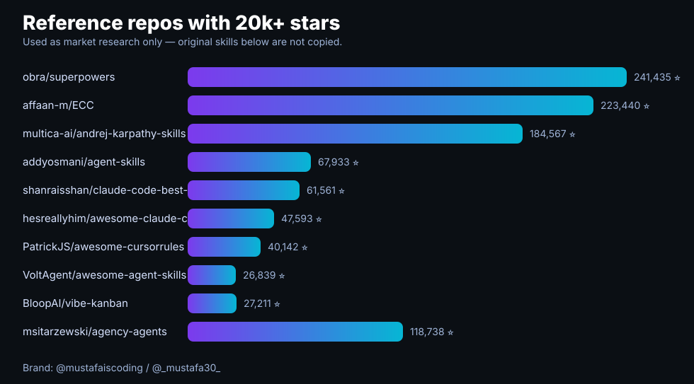
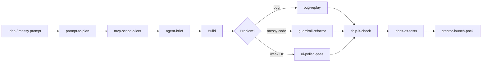
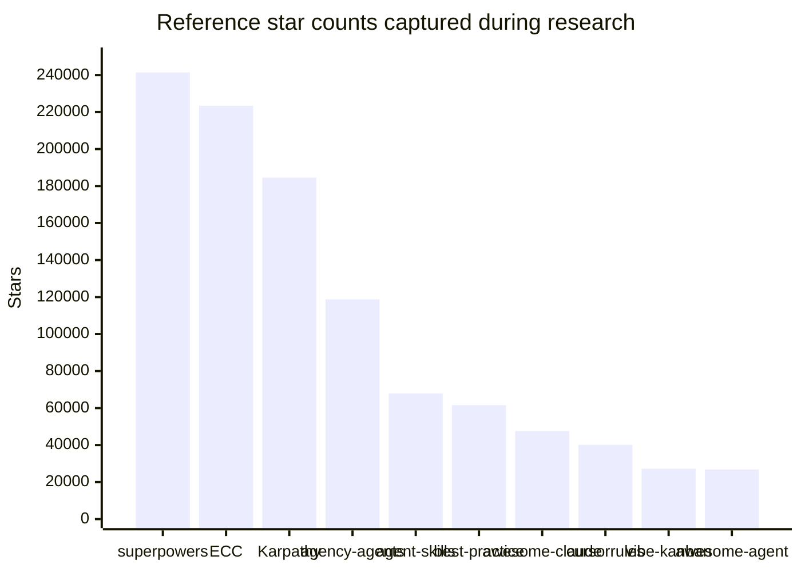

# Vibe Coder Skills

> Practical agent skills for builders who like to move fast — but still want code that runs, demos that work, and launches that look polished.

Created by **Mustafa**  
Instagram: [@mustafaiscoding](https://instagram.com/mustafaiscoding) · X/Twitter: [@_mustafa30_](https://twitter.com/_mustafa30_)

  

## The twist

Most AI-coding repos either collect a thousand rules or give you one giant manifesto. This repo is different:

- **small skills, not prompt soup** — each skill has one job;
- **vibe → verify** — every skill pushes the agent toward a proof loop;
- **creator-builder taste** — sharp README, demo-first thinking, launch assets included;
- **cross-agent friendly** — Claude Code, Cursor, Codex, Gemini CLI, OpenCode, and any agent that can read Markdown.

## Research snapshot

I looked at viral / high-star GitHub repos in the AI coding skills, Cursor rules, Claude Code, and vibe-coding space. The bar was **20k+ stars**; the repo below is an original take inspired by the category, not a copy of their content.



| Reference repo | Stars captured | What people seem to like |
|---|---:|---|
| [obra/superpowers](https://github.com/obra/superpowers) | 241,435 | agentic skills methodology |
| [affaan-m/ECC](https://github.com/affaan-m/ECC) | 223,440 | agent harness + skills |
| [multica-ai/andrej-karpathy-skills](https://github.com/multica-ai/andrej-karpathy-skills) | 184,567 | one-file coding rules |
| [addyosmani/agent-skills](https://github.com/addyosmani/agent-skills) | 67,933 | production-grade engineering skills |
| [shanraisshan/claude-code-best-practice](https://github.com/shanraisshan/claude-code-best-practice) | 61,561 | vibe coding → agentic engineering |
| [hesreallyhim/awesome-claude-code](https://github.com/hesreallyhim/awesome-claude-code) | 47,593 | Claude Code ecosystem curation |
| [PatrickJS/awesome-cursorrules](https://github.com/PatrickJS/awesome-cursorrules) | 40,142 | Cursor rules collection |
| [VoltAgent/awesome-agent-skills](https://github.com/VoltAgent/awesome-agent-skills) | 26,839 | cross-agent skill library |
| [BloopAI/vibe-kanban](https://github.com/BloopAI/vibe-kanban) | 27,211 | task board for coding agents |
| [msitarzewski/agency-agents](https://github.com/msitarzewski/agency-agents) | 118,738 | daily trending agency-style agent roles |


## Skill map





## Included skills

| Skill | Use when |
|---|---|
| [`prompt-to-plan`](skills/prompt-to-plan/SKILL.md) | Turn a loose vibe-coding idea into a small, testable build plan before the agent touches files. |
| [`context-capsule`](skills/context-capsule/SKILL.md) | Compress project facts into the smallest useful context block so agents stop guessing and start building. |
| [`mvp-scope-slicer`](skills/mvp-scope-slicer/SKILL.md) | Cut a big product idea into the smallest lovable vertical slice with demo value. |
| [`bug-replay`](skills/bug-replay/SKILL.md) | Force the agent to reproduce a bug with a tiny loop before attempting fixes. |
| [`guardrail-refactor`](skills/guardrail-refactor/SKILL.md) | Refactor quickly while protecting behavior, public APIs, and obvious security boundaries. |
| [`ship-it-check`](skills/ship-it-check/SKILL.md) | A final pre-push checklist for vibe coders: tests, secrets, docs, rollback, and screenshots. |
| [`ui-polish-pass`](skills/ui-polish-pass/SKILL.md) | Apply tasteful product polish without random redesign: hierarchy, spacing, empty states, and mobile sanity. |
| [`docs-as-tests`](skills/docs-as-tests/SKILL.md) | Make README commands, examples, and screenshots executable enough to catch broken promises. |
| [`creator-launch-pack`](skills/creator-launch-pack/SKILL.md) | Turn a shipped mini-project into an educational launch post, reel hook, and changelog. |
| [`agent-brief`](skills/agent-brief/SKILL.md) | Write one crisp handoff that tells any coding agent the role, constraints, checks, and done definition. |


## Quick install

Clone the repo, then copy the skills you want into your agent's skills folder.

```bash
git clone https://github.com/mustafa3252/vibe-coder-skills.git
cd vibe-coder-skills
```

### Claude Code / Claude-style skills

```bash
mkdir -p ~/.claude/skills
cp -R skills/* ~/.claude/skills/
```

### Cursor

Copy the Cursor rule:

```bash
mkdir -p .cursor/rules
cp .cursor/rules/vibe-coder-skills.mdc <your-project>/.cursor/rules/
```

Or paste the relevant `SKILL.md` into your project context.

### Any agent

Use the prompt template inside each `SKILL.md` and tell your model:

```text
Read this skill and follow it for the next task.
```

## Example

```text
Use the prompt-to-plan and ship-it-check skills.
Goal: Build a landing page for a tiny SaaS that turns GitHub issues into launch posts.
Constraints: Next.js, Tailwind, no auth, no database.
Done means: npm test passes and the page has a screenshot-ready hero section.
Do not: add pricing logic or a dashboard.
```

## Why vibe coders need this

Vibe coding is amazing for momentum. The failure mode is not speed — it is **unverified speed**.

These skills keep the fun part:

- quick ideas;
- fast prototypes;
- agent collaboration;
- creator-style shipping.

And add the missing guardrails:

- tiny specs;
- proof loops;
- scoped changes;
- launch-ready docs.

## Branding

Built with taste by **Mustafa**.

- Instagram: [@mustafaiscoding](https://instagram.com/mustafaiscoding)
- X/Twitter: [@_mustafa30_](https://twitter.com/_mustafa30_)

If this helps you ship cleaner with AI, star the repo and tag me with what you built.

## License

MIT — use it, remix it, and ship something useful.
