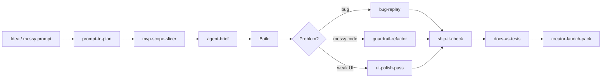

# Vibe Ship Skills

> Practical agent skills for builders who like to move fast — but still want code that runs, demos that work, and launches that look polished.

Created by **Mustafa**  
Instagram: [@mustafaiscoding](https://instagram.com/mustafaiscoding) · X/Twitter: [@_mustafa30_](https://twitter.com/_mustafa30_)

  

## Built for fast builders who still ship clean

Vibe coding works best when the agent has just enough structure to move quickly without drifting. These skills give your coding agent a simple operating system for turning ideas into working, launch-ready slices.

- **Plan before files** — turn loose prompts into small, testable tasks.
- **Build vertical slices** — avoid giant rewrites and speculative architecture.
- **Verify the output** — every meaningful change needs a test, command, screenshot, curl, or checklist.
- **Polish for launch** — docs, UI, and creator-friendly release notes are part of shipping.
- **Use anywhere** — works with Claude Code, Cursor, Codex, Gemini CLI, OpenCode, and agents that can read Markdown.

## Skill map



## Included skills

| Skill | Use when |
|---|---|
| [`prompt-to-plan`](skills/prompt-to-plan/SKILL.md) | Turn a loose vibe-coding idea into a small, testable build plan before the agent touches files. |
| [`context-capsule`](skills/context-capsule/SKILL.md) | Compress project facts into the smallest useful context block so agents stop guessing and start building. |
| [`mvp-scope-slicer`](skills/mvp-scope-slicer/SKILL.md) | Cut a big product idea into the smallest lovable vertical slice with demo value. |
| [`bug-replay`](skills/bug-replay/SKILL.md) | Force the agent to reproduce a bug with a tiny loop before attempting fixes. |
| [`guardrail-refactor`](skills/guardrail-refactor/SKILL.md) | Refactor quickly while protecting behavior, public APIs, and obvious security boundaries. |
| [`ship-it-check`](skills/ship-it-check/SKILL.md) | A final pre-push checklist for vibe coders: tests, secrets, docs, rollback, and screenshots. |
| [`ui-polish-pass`](skills/ui-polish-pass/SKILL.md) | Apply tasteful product polish without random redesign: hierarchy, spacing, empty states, and mobile sanity. |
| [`docs-as-tests`](skills/docs-as-tests/SKILL.md) | Make README commands, examples, and screenshots executable enough to catch broken promises. |
| [`creator-launch-pack`](skills/creator-launch-pack/SKILL.md) | Turn a shipped mini-project into an educational launch post, reel hook, and changelog. |
| [`agent-brief`](skills/agent-brief/SKILL.md) | Write one crisp handoff that tells any coding agent the role, constraints, checks, and done definition. |

## Quick install

Requires Node/npm so you can run `npx`. The easiest way is with the open skills CLI:

```bash
npx skills add mustafa3252/vibe-ship-skills --all
```

Install only the skills you want:

```bash
npx skills add mustafa3252/vibe-ship-skills --skill prompt-to-plan --skill ship-it-check
```

Install globally for a specific agent:

```bash
npx skills add mustafa3252/vibe-ship-skills -g -a claude-code -y
```

Use a skill without installing it:

```bash
npx skills use mustafa3252/vibe-ship-skills@prompt-to-plan | claude
```

Replace `claude` with your agent command if you use something else.

List everything in the repo:

```bash
npx skills add mustafa3252/vibe-ship-skills --list
```

### Manual install

Prefer copying files yourself?

```bash
git clone https://github.com/mustafa3252/vibe-ship-skills.git
cd vibe-ship-skills
mkdir -p ~/.claude/skills
cp -R skills/* ~/.claude/skills/
```

For Cursor project rules:

```bash
mkdir -p <your-project>/.cursor/rules
cp .cursor/rules/vibe-ship-skills.mdc <your-project>/.cursor/rules/
```

### Any agent

Open a `SKILL.md`, paste it into your agent context, and say:

```text
Read this skill and follow it for the next task.
```

## Example

```text
Use the prompt-to-plan and ship-it-check skills.
Goal: Build a landing page for a tiny SaaS that turns GitHub issues into launch posts.
Constraints: Next.js, Tailwind, no auth, no database.
Done means: npm test passes and the page has a screenshot-ready hero section.
Do not: add pricing logic or a dashboard.
```

## Why vibe coders need this

Vibe coding is amazing for momentum. The failure mode is not speed — it is **unverified speed**.

These skills keep the fun part:

- quick ideas;
- fast prototypes;
- agent collaboration;
- creator-style shipping.

And add the missing guardrails:

- tiny specs;
- proof loops;
- scoped changes;
- launch-ready docs.

## Branding

Built with taste by **Mustafa**.

- Instagram: [@mustafaiscoding](https://instagram.com/mustafaiscoding)
- X/Twitter: [@_mustafa30_](https://twitter.com/_mustafa30_)

If this helps you ship cleaner with AI, star the repo and tag me with what you built.

## License

MIT — use it, remix it, and ship something useful.
