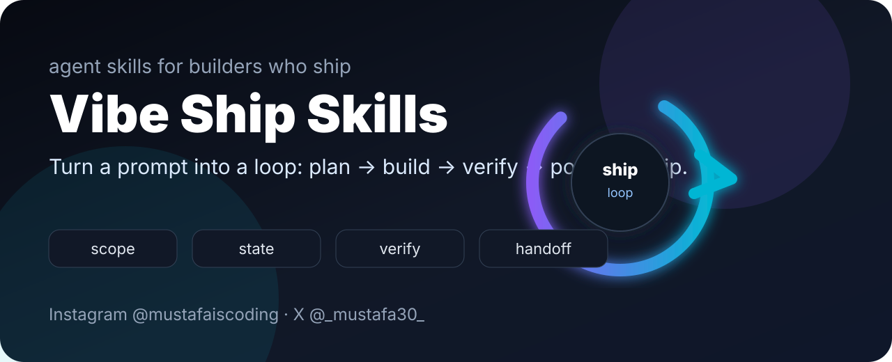
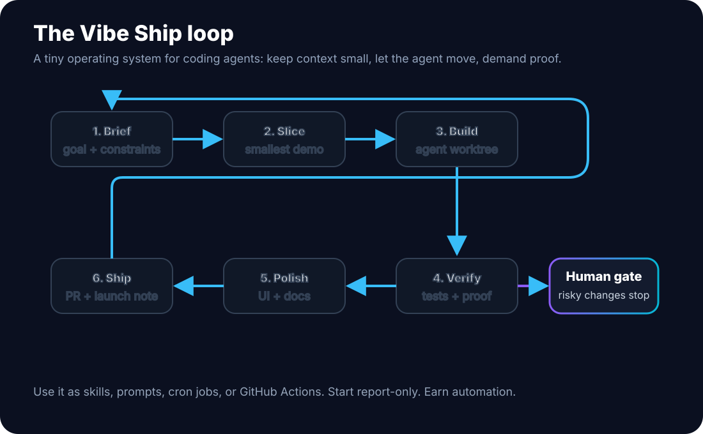
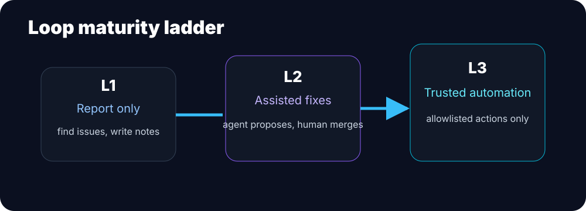

# Vibe Ship Skills

> Loop-style agent skills for vibe coders who want speed without the mess.

<p align="center">
  
</p>

<p align="center">
  <a href="https://github.com/mustafa3252/vibe-ship-skills/stargazers"></a>
  <a href="https://github.com/mustafa3252/vibe-ship-skills/blob/main/LICENSE"></a>
  
  
  
</p>

Created by **Mustafa**  
Instagram: [@mustafaiscoding](https://instagram.com/mustafaiscoding) · X/Twitter: [@_mustafa30_](https://twitter.com/_mustafa30_)

## What this is

Vibe Ship Skills is a small operating system for AI coding agents.

Instead of prompting the agent over and over, you give it a loop:

1. understand the goal,
2. slice the smallest useful version,
3. build in a tight scope,
4. verify with evidence,
5. polish the user-facing parts,
6. hand you a clean ship decision.

It is our take on agent loops: practical, creator-friendly, and built for vibe coders who want to move fast without waking up to a repo full of random changes.

## Quick install

Requires Node/npm so you can run `npx`.

```bash
npx skills add mustafa3252/vibe-ship-skills --all
```

Install only the skills you want:

```bash
npx skills add mustafa3252/vibe-ship-skills --skill prompt-to-plan --skill ship-it-check
```

Install globally for Claude Code:

```bash
npx skills add mustafa3252/vibe-ship-skills -g -a claude-code -y
```

Use a skill without installing it:

```bash
npx skills use mustafa3252/vibe-ship-skills@prompt-to-plan | claude
```

Replace `claude` with your agent command if you use something else.

List the skills:

```bash
npx skills add mustafa3252/vibe-ship-skills --list
```

## Star growth

If this helps you ship cleaner with AI, star the repo. The graph below updates as the project grows.

<p align="center">
  <picture>
    <source media="(prefers-color-scheme: dark)" srcset="https://api.star-history.com/svg?repos=mustafa3252/vibe-ship-skills&type=Date&theme=dark" />
    
  </picture>
</p>

## The loop system

<p align="center">
  
</p>

A good loop has six parts:

| Part | What it does | Vibe Ship default |
|---|---|---|
| Trigger | Starts the work | manual prompt, schedule, issue label, PR event |
| Scope | Keeps the agent contained | one vertical slice, explicit non-goals |
| State | Carries context across runs | `STATE.md`, issue comments, changelog notes |
| Worker | Makes the change | coding agent in a branch or worktree |
| Verifier | Checks the work | tests, screenshots, curl, lint, second-agent review |
| Human gate | Stops risky automation | you approve deletes, deploys, auth, billing, merges |

## Maturity ladder

<p align="center">
  
</p>

Start boring. Earn trust.

| Level | Mode | Use it for | Human approval |
|---|---|---|---|
| L1 | Report-only | triage, summaries, risk notes, recommendations | before any change |
| L2 | Assisted fixes | small PRs, docs, tests, safe refactors | before merge |
| L3 | Trusted automation | allowlisted chores with rollback | after clear policy exists |

Most teams should live at L1 and L2 for a while. L3 is not the goal. Shipping safely is the goal.

## Included skills

| Skill | Use when |
|---|---|
| [`prompt-to-plan`](skills/prompt-to-plan/SKILL.md) | Turn a loose vibe-coding idea into a small, testable build plan before the agent touches files. |
| [`context-capsule`](skills/context-capsule/SKILL.md) | Compress project facts into the smallest useful context block so agents stop guessing and start building. |
| [`mvp-scope-slicer`](skills/mvp-scope-slicer/SKILL.md) | Cut a big product idea into the smallest lovable vertical slice with demo value. |
| [`bug-replay`](skills/bug-replay/SKILL.md) | Force the agent to reproduce a bug with a tiny loop before attempting fixes. |
| [`guardrail-refactor`](skills/guardrail-refactor/SKILL.md) | Refactor quickly while protecting behavior, public APIs, and obvious security boundaries. |
| [`ship-it-check`](skills/ship-it-check/SKILL.md) | A final pre-push checklist for vibe coders: tests, secrets, docs, rollback, and screenshots. |
| [`ui-polish-pass`](skills/ui-polish-pass/SKILL.md) | Apply tasteful product polish without random redesign: hierarchy, spacing, empty states, and mobile sanity. |
| [`docs-as-tests`](skills/docs-as-tests/SKILL.md) | Make README commands, examples, and screenshots executable enough to catch broken promises. |
| [`creator-launch-pack`](skills/creator-launch-pack/SKILL.md) | Turn a shipped mini-project into an educational launch post, reel hook, and changelog. |
| [`agent-brief`](skills/agent-brief/SKILL.md) | Write one crisp handoff that tells any coding agent the role, constraints, checks, and done definition. |

## Loop patterns

| Pattern | What it does | Start here |
|---|---|---|
| [Daily hygiene](patterns/daily-hygiene.md) | scans issues, TODOs, failing checks, and stale work | L1 report |
| [PR babysitter](patterns/pr-babysitter.md) | watches PRs and explains what is blocking merge | L1 comment |
| [Bug replay loop](patterns/bug-replay-loop.md) | reproduces the bug before touching the fix | L2 PR |
| [Launch polish loop](patterns/launch-polish-loop.md) | checks README, UI, screenshots, and launch copy | L2 checklist |
| [Dependency scout](patterns/dependency-scout.md) | reviews dependency updates without blind bumping | L1 report |
| [Creator devlog](patterns/creator-devlog.md) | turns commits into a human build update | L1 draft |

See all patterns in [`patterns/`](patterns/README.md).

## Example loop brief

```text
Use Vibe Ship Skills.
Loop: launch polish
Level: L2 assisted PR
Goal: Prepare this repo for a public launch.
State source: README.md, open issues, recent commits, screenshots.
Allowed actions: edit docs, add examples, run validation commands, open a PR.
Never do: deploy, delete files, change secrets, modify billing/auth, auto-merge.
Done means: PR with a short summary, screenshots if relevant, and exact verification output.
```

More templates live in [`examples/prompts/`](examples/prompts/loop-brief.md).

## Suggested repo files

You can copy these into any project that uses agent loops:

| File | Purpose |
|---|---|
| [`LOOP.md`](LOOP.md) | describes the loops allowed in the repo |
| [`STATE.md`](STATE.md) | durable project state outside the chat window |
| [`docs/loop-design.md`](docs/loop-design.md) | how to design a safe loop |
| [`docs/safety.md`](docs/safety.md) | rules for human gates and risky actions |
| [`examples/github-actions/daily-hygiene.yml`](examples/github-actions/daily-hygiene.yml) | starter scheduled hygiene loop |

## Manual install

Prefer copying files yourself?

```bash
git clone https://github.com/mustafa3252/vibe-ship-skills.git
cd vibe-ship-skills
mkdir -p ~/.claude/skills
cp -R skills/* ~/.claude/skills/
```

For Cursor project rules:

```bash
mkdir -p <your-project>/.cursor/rules
cp .cursor/rules/vibe-ship-skills.mdc <your-project>/.cursor/rules/
```

## Why vibe coders need this

Vibe coding is great for momentum. The failure mode is letting the agent run longer than your understanding.

These skills keep the fun part: quick ideas, fast prototypes, agent collaboration, and creator-style shipping.

They add the missing guardrails: small specs, proof loops, scoped changes, human gates, and launch-ready docs.

## Brand

Built with taste by **Mustafa**.

- Instagram: [@mustafaiscoding](https://instagram.com/mustafaiscoding)
- X/Twitter: [@_mustafa30_](https://twitter.com/_mustafa30_)

If this helps you ship cleaner with AI, star the repo and tag me with what you built.

## License

MIT. Use it, remix it, and ship something useful.
